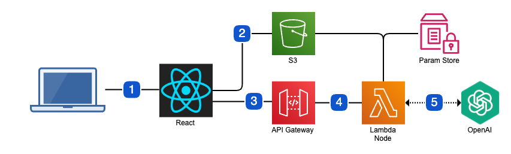

# AI-Village
 Open-source prototype of an AI game build on AWS Lambda and using React

# Instructions
To start your game, click on "Add Conversation" to add more conversations; more chats means more points! Then click "Begin." As you read the villagers' chats, try to find the parts that the AI is making up. If you think it's happening, click the "I'm noticing AI generation" button. But be careful, you can only guess once per chat! An exactly right answer gives you 15 points. If you want to try again, just refresh the page to start over. Happy playing!

# Architecture

1. User goes to the link provided to play the game.
2. The front-end is a static website served from an S3 bucket. A few game assets (json configuration) exist in the bucket as well.
3. Backend calls are made to API gateway which routes to a Lambda.
4. The Lambda is written in Node. The Lambda gets some assets from S3 and the OpenAI key from Parameter Store.
5. The OpenAI API calls drive the main game mechanic.

Important note: the whole site is IaC, written in terraform. Deployment and teardown happen with single commands.

# Information
This is based on the project here:
https://github.com/terraformita/terraform-aws-serverless-app/tree/main/examples/simple

  If you're going to use it, start here:
  https://medium.com/@kurianoff/deploy-serverless-react-app-with-node-js-express-backend-to-aws-with-terraform-in-under-15-minutes-2386bf0c58e9

# Gratitude

Thanks to https://github.com/kurianoff for creating the forked project, quickly fixing a bug, and pointing me in the right direction.
Thanks to ChatGPT for helpful responses.
